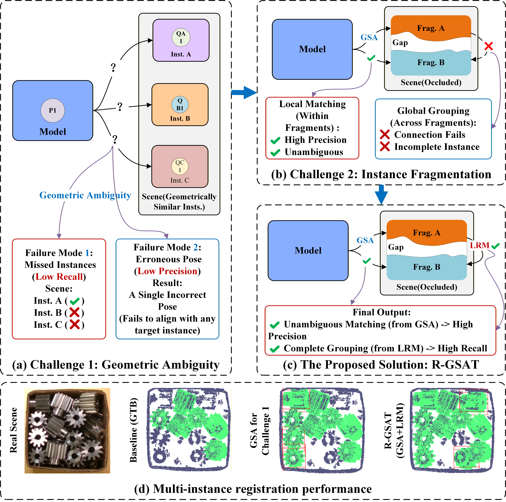

# R-GSAT

Official repository for:

**R-GSAT: Reliability-Modulated Geometric Self-Attenuating Transformer for Multi-Instance Registration**

This repository accompanies our manuscript submitted to *Pattern Recognition*.

## Overview

R-GSAT is designed for robust multi-instance point cloud registration in challenging scenes with repeated geometry, clutter, and severe occlusion.

The proposed framework focuses on two major challenges:

* **Feature-level geometric ambiguity**, addressed by Geometric Self-Attenuation (GSA).
* **Instance-level fragmentation under occlusion**, addressed through global geometric reasoning with a Learnable Reliability Modulator (LRM).

  

## Code Release

The source code is currently being organized and cleaned for public release.

Training and evaluation code, configuration files, pretrained models, and detailed reproduction instructions will be released in this repository.

## Datasets

Experiments are conducted on:

* ROBI
* Scan2CAD

Please refer to the original dataset providers for dataset access and licenses.

## Results

Detailed quantitative and qualitative results are reported in the accompanying manuscript.

## Citation

Citation information will be updated upon publication.

## License

License information will be provided together with the source-code release.
